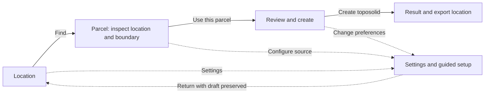

# Revit usability overhaul: research and implementation plan

Date: 2026-09-30. Status: owner accepted; implementation preparation and independent plan review in progress.

Tracking: [Issue #60](https://github.com/mjfrancese/SolidGround/issues/60). The issue includes the full researched proposal so review does not depend on an unpublished repository file.

The owner requested research, a concrete plan, and a tracked issue before implementation. This document covers a complete first-run and repeat-use experience for SolidGround in Revit 2027. Research and planning used repository inspection and web sources after computer use was stopped. The operational observations below were collected earlier in the session; no private property details or screenshots are reproduced here.

## 1. Outcome and evidence

An operator should be able to create terrain for a property using SolidGround's UI, without editing JSON, copying configuration files, changing environment variables, or repeatedly choosing the same preferences. Finding a location should visibly advance the task with one action. Every input and its selected value must remain readable in light, dark, and Windows High Contrast themes.

The terrain pipeline worked during the observed session, and its export passed the existing CLI verification command with a bit-exact coordinate round trip. The failures concern interaction and setup:

| Finding | Evidence | Consequence |
| --- | --- | --- |
| U01: Find does work but leaves the user on the entry page | `SolidGroundDialogViewModel.Geocode` updates candidates without advancing; `SolidGroundDialog` retains a separate Next button | The user cannot tell that Find succeeded and must perform an extra navigation action |
| U02: Missing parcel setup is a dead end | A live run reached the inline message directing the operator to configure `addressAndParcel` in a settings file and reopen the tool; `SolidGroundDialogHost` can construct a null parcel source | A valid address cannot finish the workflow through the UI |
| U03: Configuration describes an old development workflow | `RevitSettingsIo.TemplateJson` defaults to process mode with placeholder local files; `CreateToposolidCommand.LoadDocumentAndSettings` must load settings before showing the dialog | A fresh or stale install can fail before guided setup is available |
| U04: Preferences occupy repeated wizard pages | `SolidGroundDialogStep` defines eleven pages, including separate point-budget and unit pages | Repeat users must navigate choices they rarely change |
| U05: Dark-theme control states are incomplete | The live session showed unreadable selected ComboBox values and washed-out button labels; `DialogTheme` supplies brushes while controls still use parts of platform templates | Brush constants alone cannot establish runtime legibility |
| U06: Saving configuration has an access problem | The observed settings file allowed standard-user reads but required elevation for replacement | A new Settings dialog would still fail if it merely rewrote the same file |
| U07: Feedback and layout are weak | The current modal uses a blocking lookup bridge, no visible stage indicator, and cramped candidate/legal-text presentation | Users cannot confidently monitor work, compare candidates, or recover |
| U08: Regression coverage does not render the UI | `RevitInteractiveDialogTests` inspects source; Issue #53 proposes real WPF binding tests | Existing tests cannot prove a closed dropdown, hover state, or focused control is readable |
| U09: Terrain extension also moves the property boundary | `CreateToposolidCommand` derives `boundary` from `ClipResult.EffectiveRegion` and passes it to both Toposolid and PropertyLine profile construction | A positive buffer changes legal-boundary geometry, contrary to the owner's requirement |
| U10: Extension can also change placement/elevation anchors | `LocalOriginFactory` uses the clipped grid envelope for southwest/centroid origins; PropertyLine profiles use the expanded terrain samples' minimum Z | Separating the two polygon outlines alone is insufficient to guarantee a fixed property line when extension changes |

These are observed examples and code findings, not a timed baseline study or proof that every control fails in every environment.

## 2. Research basis and design implications

All web sources below were retrieved on 2026-09-30. These are primary design guidance, standards, or framework documentation. Their application to SolidGround is our design inference, to be tested with users.

| Source | Relevant principle | SolidGround decision |
| --- | --- | --- |
| [Nielsen Norman Group: Progressive Disclosure](https://www.nngroup.com/articles/progressive-disclosure/) | Show common decisions first; expose specialized options when needed | Separate persistent Settings and optional run overrides from the property task |
| [NN/g: Visibility of System Status](https://www.nngroup.com/articles/visibility-system-status/) | Timely feedback explains whether an action registered and what is happening | Find changes stage automatically; visible progress, errors, and results replace silent state changes |
| [Microsoft: Wizards](https://learn.microsoft.com/en-us/windows/win32/uxguide/win-wizards) | Reduce unnecessary questions; keep each page coherent around a task | Three meaningful stages, with ambiguity handled inside a stage rather than eleven mandatory pages |
| [Microsoft: Command Buttons](https://learn.microsoft.com/en-us/windows/win32/uxguide/ctrl-command-buttons) | Specific action labels and one default action make behavior predictable | Find, Use this parcel, and Create toposolid; Enter invokes the visible primary action |
| [Microsoft: Property Windows](https://learn.microsoft.com/en-us/windows/win32/uxguide/win-property-win) | Application options belong in an options surface; group them around user goals | One Settings tool with coherent Terrain, Sources, and Files sections and Save/Cancel semantics |
| [W3C: Text Contrast](https://www.w3.org/WAI/WCAG22/Understanding/contrast-minimum.html), [Non-text Contrast](https://www.w3.org/WAI/WCAG22/Understanding/non-text-contrast.html), and [Focus Visible](https://www.w3.org/WAI/WCAG22/Understanding/focus-visible.html) | Text, meaningful component boundaries/states, and keyboard focus must be perceivable | Numeric contrast targets, a full control-state matrix, and keyboard testing |
| [Microsoft: WPF Styles and Templates](https://learn.microsoft.com/en-us/dotnet/desktop/wpf/controls/styles-templates-overview), [ComboBox](https://learn.microsoft.com/en-us/dotnet/desktop/wpf/controls/combobox) | Shared resources and templates control appearance, including different control states | Reusable WPF styles for both dialogs, including closed/open dropdowns, selection, hover, focus, and disabled states |
| [Autodesk: Revit Publisher Guidelines](https://aps.autodesk.com/marketplace/publisher-center/revit-publisher-guidelines) | Setup should be ready to use without manual file operations; instructions should be actionable | Guided source/key setup and recovery in the add-in; update the ribbon help to describe the interactive task |
| [NN/g: Usability Testing 101](https://www.nngroup.com/articles/usability-testing-101/) | Observe representative users doing realistic tasks, then iterate | Test first use, repeat use, ambiguity, and recovery before declaring the redesign successful |
| [Autodesk Revit 2027: Create a Terrain](https://help.autodesk.com/view/RVT/2027/ENU/?guid=GUID-E325CDE7-5468-43C8-BEAD-EC5AF13231F0) | The terrain's elevation points and boundary elevations both influence the shaped surface | Investigate boundary elevation constraints as well as clipping when assessing edge artifacts |
| [Esri: TINs](https://doc.esri.com/en/arcgis-pro/latest/help/data/tin/tin-in-arcgis-pro.html), [Delineate TIN Data Area](https://pro.arcgis.com/en/pro-app/3.6/tool-reference/3d-analyst/delineate-tin-data-area.htm) | Triangulated surfaces depend on point distribution; long perimeter triangles can mark poorly supported interpolation | Compare sample density, edge support, and gaps before assuming an offset alone cures distortion. These describe Esri's TIN, not Revit's undocumented triangulation behavior |
| [NetTopologySuite: BufferParameters](https://nettopologysuite.github.io/NetTopologySuite/api/NetTopologySuite.Operation.Buffer.BufferParameters.html) | Corner joins and arc approximation affect the resulting offset polygon | Retain the managed projected-distance buffer; test rounded corners, short edges, holes, and multipart topology |
| [NIST: U.S. Survey Foot](https://www.nist.gov/pml/us-surveyfoot) | Survey and international feet have distinct exact definitions; modern U.S. practice retired the survey foot after 2022 | Keep the repository's explicitly chosen legacy definition available/default, label it accurately, and convert UI distances without silently reinterpreting them |
| [Autodesk Revit 2027: Sub-divide a Toposolid](https://help.autodesk.com/view/RVT/2027/ENU/?guid=GUID-BA7C38A7-7E8B-45CC-B4A3-950D19B48C66), [Subdivision Properties](https://help.autodesk.com/view/RVT/2027/ENU/?guid=GUID-03955E27-EFD7-4ED2-8DC7-FC321FE43F12) | A subdivision follows its parent shape; its own vertical offset, contours, and export settings matter | Evaluate the owner's expanded-host plus parcel-subdivision method before choosing how to present a clean parcel edge |

Microsoft's desktop UX guide explicitly identifies its visual examples as Windows 7-era guidance. We use its interaction principles, not its old visual styling. WCAG is a web standard; its thresholds are design targets for this desktop UI, not a claim of desktop WCAG certification. Autodesk's marketplace guidance informs usability; it does not require changing this repository's distribution model or its owner-approved dedicated ribbon tab.

The sources do not prescribe exactly three screens. That is a proposal based on SolidGround's actual dependent decisions: identify a location, confirm a parcel, and approve creation.

## 3. Proposed interaction design

### 3.1 The routine path

Returning from Settings resumes the originating stage; the diagram's return arrow is illustrative, not a forced return to Location.

1. **Location.** Default to a street-address field, with an explicit Coordinates option exposing separately labeled latitude and longitude inputs. Retain pasted coordinate-pair support. Show one primary **Find** button in the footer, replacing the entry page's separate Find/Next pair. Provide Settings and an optional Other area options disclosure.
2. **Parcel.** Find automatically opens this stage after a successful geocode or valid coordinates. Show the resolved location prominently. For one geocode candidate, start parcel lookup automatically; acquiring candidates does not confirm either the location or parcel. For multiple geocode candidates, show the alternatives here and require **Use this location** before querying its parcels. Present candidate rows with address, parcel identifier, area, and containment/nearby status, plus a persistent details panel and a small vector boundary preview. **Use this parcel** explicitly confirms both the displayed location and the selected boundary and advances to Review. Show that meaning next to the button. A point outside a nearby parcel always requires an explicit candidate selection.
3. **Review and create.** Show the confirmed location/boundary, source attribution, terrain settings summary, document Level/Toposolid type, a read-only terrain-extension summary, export destination, and a default-off shared-coordinates checkbox. The extension is changed in Settings, not a field in the creation tool. Expand Run options only when needed. Keep the concise site-form accuracy limitation visible; longer provenance/license details expand without another page. **Create toposolid** is the only action that can start elevation acquisition and document creation after authoritative Preflight.

For the uncomplicated repeat-use case, after opening the dialog and entering an address, the required primary actions are Find, Use this parcel, and Create toposolid. Selecting a parcel row may add a selection action. Ambiguity, missing setup, and deliberate overrides require additional actions because they are actual decisions, not redundant navigation.

The preview uses already-acquired polygon coordinates in a managed WPF vector surface, with the geocoded point and clear orientation. It is a confirmation aid, not a basemap or survey drawing. Do not embed a browser, use map tiles, or introduce native dependencies. A stateless external map link can be delivered through Issue #52. Keyboard users must have equivalent candidate text/details without relying on the preview.

### 3.2 Find, navigation, and invalidation contract

| State/action | Required behavior |
| --- | --- |
| Address or coordinate validation fails | Stay in Location; show the field error, focus the first invalid field, and send no lookup request |
| Find succeeds | Open Parcel automatically; no Next click or second Find is required |
| No geocode match | Keep the entered text; offer Edit address, Coordinates, and Retry |
| Geocoding is ambiguous | Require a location choice; never silently confirm the highest score |
| Parcel source is absent or unusable | Keep the successful location; show Configure parcel source and Choose a local boundary actions in the Parcel stage |
| Source setup is saved | Rebuild the source and resume parcel lookup from the preserved location, without closing/reopening SolidGround |
| Settings setup is canceled | Preserve the draft and show the unresolved setup condition; no document changes |
| Address/coordinates change | Invalidate confirmed location, parcel, preview, and readiness for Create; retain unrelated run options |
| Parcel source changes | Invalidate parcel results/confirmation and re-query the retained location; old results cannot enable Create |
| Unit/budget changes | Retain the confirmed parcel; refresh summaries and budget warning; re-check Preflight before acquisition |
| Terrain extension changes in Settings | Keep the original parcel confirmation and placement anchor; rebuild only the terrain extent/preview/estimate, showing any topology or source-coverage warning before Create |
| Back/Edit location | Restore entered values; unchanged inputs reuse the current valid lookup result without an automatic extra request |
| A request finishes after edit/cancel | Discard its result using request identity/version; it cannot resurrect an old selection |
| Enter | Invoke exactly the visible, enabled primary action; never invoke hidden navigation or Create while a lookup is pending |
| Escape/Cancel | Cancel lookup work and return a canceled command without a transaction; during an active creation transaction use the existing controlled completion/rollback policy |

Use one primary action location across stages, plus consistently placed Back and Cancel. Display Location / Parcel / Review with the current stage and an accessible stage announcement. Secondary links must explain the action; disabled actions have an adjacent reason rather than only a tooltip.

### 3.3 Settings: stable preferences and run choices

Add a **Settings** button beside Create Toposolid in the existing SolidGround panel. It opens the same Settings UI available inside the property dialog. It must be usable before configuring a property and must never modify the Revit document. Verify its behavior with no active document in Revit 2027 before relying on that entry point.

| Setting | Normal location and lifetime | Default/behavior |
| --- | --- | --- |
| Foot definition/output unit | Terrain settings; saved per operator | U.S. survey foot remains the default; state exact definitions of survey and international feet. Preserve existing meter support under advanced options |
| Maximum terrain points | Terrain settings; saved per operator | 15,000; positive integer, current supported upper bound, and inline warning against the running machine's detected native threshold |
| Terrain beyond property line | Terrain settings; saved per operator | Nonnegative distance in the operator's preferred display units; affects terrain only. Preserve an imported distance; zero retains exact parcel extent. No new nonzero universal default is claimed without edge tests |
| Distance display units/format | Terrain settings; saved per operator | Follow the chosen foot definition initially; support international feet, international inches, feet-and-inches, U.S. survey feet, and metres. Changing display units converts the value while preserving its physical distance |
| Simplification method | Advanced Terrain settings; saved per operator | Curvature-aware remains the default; simple sampling remains clearly labeled; no accuracy guarantee derived solely from point count |
| Geocoder | Sources settings; saved per operator | Census by default; keyed providers remain explicit opt-ins |
| Parcel source/county registrations | Sources settings; saved locally | Choose authorized county service or local parcel data; no fabricated nationwide coverage or silently shipped real-county default |
| Elevation mode and local raster/sidecars | Sources settings; saved locally | Live USGS 1 m for a new UI setup; existing process mode is preserved when importing prior settings. Browse for raster, projection, and source metadata |
| API-key source | Sources setup; environment or Revit-session memory | Status only for environment keys; masked session entry is proposed in section 6. No persisted keys |
| Export folder and naming | Files settings; saved per operator; run folder override in Review | Use a user-writable folder chosen through Browse; display the effective path before creation |
| Network timeout, nearby search distance, origin policy, sampler coverage fraction | Advanced settings; saved locally | Preserve validated existing defaults; show units and validation; explicit origin exposes X/Y/Z and their coordinate/unit interpretation |
| Address/point and area mode | Location; current run only | No persistent address history by default |
| Parcel selection | Parcel; current run only | Original legal geometry is confirmed once; terrain-extension preferences never change that geometry |
| Level and Toposolid type | Review; document-dependent | Resolve from this document; do not carry an ElementId or unresolved name from another document as a valid selection |
| Shared-coordinates write | Review; current run only | Always unchecked at the start of a new run, including after importing old configuration; never a remembered global opt-in |

Review shows effective unit, budget, source, and terrain extension even though they are configured in Settings. The terrain-extension field exists only in Settings; Review links there. Other run-only overrides do not silently overwrite preferences; an explicit Save as my default action is needed. Settings uses Save/Cancel with a draft: Cancel and window close leave persisted values unchanged. Restore defaults previews its effects and requires Save. Avoid Reset actions that erase source registrations or license text along with appearance/preferences.

### 3.4 Guided source setup and recovery

On first use, open the actual tool with a setup status, not a JSON template failure. Address lookup may proceed while parcel setup is incomplete, preserving useful progress. From Settings or the Parcel stage offer:

- **Local parcel data:** Browse for the supported GeoJSON source, provide its source label and actual license/disclaimer, and preview validation results. For one boundary, Other area options also accepts GeoJSON/WKT using the existing AOI parsers. Purchased-data terms are supplied truthfully; no invented purchase date or expiry.
- **County service:** enter a permitted HTTPS ArcGIS parcel service URL; load layer/field metadata; select the parcel layer, county GEOID, identifier, situs-address field, and optional approved parcel attributes in dropdowns. Keep field mapping in an Advanced section. Require the actual attribution/license text and an operator confirmation of authorized use. Metadata cannot establish redistribution rights by itself. Reject owner/mailing-field mappings with the existing guard. Write registry entries through the UI; importing an existing registry is an optional migration aid, never the required first-run path.
- **Elevation access:** show USGS 1 m access requirements and a key-request link, key availability without its value, and actionable authorization/network failures. A generic reachability check is not proof that a key has USGS 1 m entitlement. No coarser fallback and no paid acquisition on Find.

Unregistered county, malformed local data, missing files, HTTP denial, no parcel match, and timeout get distinct explanations and relevant actions. Explain that a geocoded location can be valid without a parcel source covering it. A radius/bounding-box area can be an explicit alternative; never silently substitute it for a requested property boundary or create a property line for a nonparcel area.

Other area options provides UI fields for the existing bounding box, point/radius, and local polygon AOIs. Legacy Use the area in the settings file becomes a readable/editable imported area, rather than the only way to access those modes.

### 3.5 Visual and accessibility specification

Use the existing code-built managed WPF approach. Centralize semantic resources for window/surface, text/secondary text, border, accent/selection text, error, focus, and disabled state. Share them between Create and Settings. High Contrast uses Windows system brushes and never overrides them with branding.

Test TextBox, numeric input, ComboBox (closed and popup), ListBox/candidate row, Button, CheckBox, RadioButton, links, scrolling, errors, and preview in normal, hover, keyboard focus, pressed, selected, invalid, and disabled states where applicable. The closed selected ComboBox value and selected popup row are separate cases. Do not assume setting Background/Foreground styles every template child.

Targets: normal text at least 4.5:1; large text at least 3:1; meaningful active component boundaries and state cues at least 3:1 against adjacent colors. Product policy also targets 4.5:1 for disabled-action labels against their background, despite WCAG's inactive-control exception; indicate unavailability with styling and explanatory text rather than washed-out opacity alone. Windows High Contrast honors the operator's system palette.

Initial layout target: approximately 760 by 640 device-independent pixels, resizable, constrained to the work area. On a 1280 by 720 display at 100%, and a 1920 by 1080 display at 150%/200%, the primary footer remains reachable without horizontal scrolling. Content may scroll vertically. Use wrapped legal/license text and a details panel instead of long horizontal candidate rows. At narrow sizes stack preview/details. Labels sit above inputs; units and short help remain visible. Tooltips supplement labels/help rather than carry essential instructions.

Provide logical Tab/Shift+Tab order, access keys, accessible names and roles, selected-state announcements, stage/status/error announcements, and a visible focus indicator. The vector preview needs a textual summary of containment, area, and nearby distance. Reopen in a changed Revit theme correctly; do not add a theme-change API subscription without verifying it against 2027.

### 3.6 Progress and completion

Geocoding, county lookup, and parcel requests must keep the modal's dispatcher responsive using awaited Core I/O and cancellation. Snapshot inputs before requests; marshal only UI updates to the dispatcher. Revit API reads remain on the owning UI thread. After the modal returns, keep the existing command's preflight/acquisition/transaction boundaries; this plan does not move document creation into a background task or introduce a live-driving harness.

Show truthful stages: Finding location, Finding parcel, Ready to create, then the existing acquisition/processing/creation status. Use indeterminate progress where total work is unknown. Render lookup status within 100 ms in the synthetic delayed-request test; cancel returns control within one second in that test. Do not claim a network completion deadline or expose a Cancel control during creation that cannot actually cancel safely. Actual elevation fetch retains the existing no-automatic-retry, at-most-two-request rule.

The existing native success/failure TaskDialog remains the single authoritative result. Show created terrain/property-line result, retained point count, and export folder with an Open folder action. Add a Show terrain action using the verified host surface only when a valid document/view remains. If framing fails, preserve successful creation and explain how to find the element. Do not alter origin/elevation/shared coordinates merely to improve viewing. Tell the operator to save the Revit model through Revit; automatic RVT saving is outside this add-in change.

### 3.7 Terrain extension, legal boundary, and edge-quality research

**Owner requirement:** the property line always follows the original parcel, while only the toposolid extends outward by the saved distance. This is a horizontal context margin, not a vertical elevation offset, legal-boundary edit, terrain extrapolation, or parcel enlargement.

The existing feature is a real projected-distance buffer: `ParcelBoundaryAoiFactory` carries `LinearDistance`; `ClipRegionFactory` reprojects the parcel; `GridClipper.BuildEffectiveRegion` applies a positive NetTopologySuite buffer in the grid CRS's linear units. The dialog expresses its input as `bufferMeters`. In `CreateToposolidCommand`, the resulting effective region becomes the single boundary used by both created elements. That shared-boundary coupling is the defect; the current zero-buffer case conceals it. No computer use was resumed to investigate this.

Keep three distinct extents:

1. **Legal parcel:** the original unbuffered polygon, including its original shells/holes/components and parcel identity. It supplies PropertyLine geometry, confirmed parcel area, and parcel provenance. Existing tolerance cleanup may remove redundant vertices, but must not reinterpret the boundary as an expanded parcel.
2. **Terrain extent:** the projected parcel buffered by the saved distance. It supplies the Toposolid profile and terrain clipping. Preview original parcel and expanded terrain as independently labeled outlines. Terrain area is a separate value from parcel area.
3. **Fetch envelope:** the rectangular request needed to cover the terrain extent, including any existing provider minimum-envelope rule. A larger fetched rectangle alone is not a terrain extension: points outside the effective clip are currently discarded.

Use the same CRS, unit conversion, and local frame for both legal and terrain geometry. For new parcel UI runs, derive southwest/centroid placement anchors from the unbuffered projected parcel envelope, using the existing whole-source-unit snapping, not the buffered grid envelope. Explicit user origins remain explicit. Derive the legal PropertyLine's constant Z from valid, unsimplified samples inside the original parcel, independently of the terrain extension and point budget; preserve the existing planar-profile requirement. Terrain boundary plane policy remains separate. Existing created models/placement records are never moved or reinterpreted; all new resolved origin values remain explicit in current provenance fields. Regression tests must check actual model coordinates, not merely the source polygon before origin subtraction. This origin selection is scoped to the new Revit parcel workflow; do not change CLI defaults.

Keep a canonical finite, nonnegative distance in metres internally; display/parse it in Settings using explicit preferences. Reuse `LengthConverter` for feet/metres. International inches are exactly one twelfth of an international foot (0.0254 m); do not invent a survey-inch definition when the user selects inches. A feet-and-inches parser uses the international definition and labels it. Survey feet remain exactly 1200/3937 m. Store the distance and display preference separately, so changing from feet to inches or changing foot definition cannot reinterpret the old numeric value as a different physical length. Display rounding must not overwrite the full-precision saved value. Reject negative/nonfinite/invalid text with a visible field error. Area/radius distances in Other area options follow the same display preference.

The evidence supports testing padding, but does not prove it fixes this session's distortion. Autodesk's 2027 tutorial explicitly edits boundary elevations as part of shaping terrain. This code builds every terrain profile vertex at the retained samples' minimum Z. That planar boundary constraint, the grid's cell-center sampling, simplification, long edge triangles, or missing elevation cells are plausible contributors; the exact Revit behavior must be measured. Do not drape profile vertices into a nonplanar CurveLoop to work around the artifact: the combined creation overload requires planar profiles.

Additional considerations:

- An expanded terrain region needs actual elevation data outside the parcel. Live requests must cover it; process-mode rasters may not. If the source grid envelope does not cover the requested terrain extent, block creation with Browse for a larger raster or Change extension in Settings actions. NODATA gaps inside an otherwise covering grid get a visible coverage warning requiring acknowledgment; never describe those areas as complete measured terrain. Never fill a gap with a NODATA sentinel or invent elevations to hide an edge.
- More area at a fixed point budget can reduce retained detail inside the parcel. Show buffered area/fetch estimate and actual interior/perimeter sample support; do not silently raise the budget above the machine limit. Compare achieved errors inside the original parcel, not just the larger surface's aggregate count.
- Preserve current round joins initially. A geometric positive buffer may merge nearby components or shrink/remove holes. Show that change in preview with an explicit warning acknowledged by the parcel/review confirmation; the legal PropertyLine and its holes never change. Validate the resulting loops against Revit short-curve tolerances. An offset within arc/cleanup tolerance is a numerical approximation, not an exact survey guarantee.
- A larger fetch can increase data size, processing time, and provider-area-limit exposure. Reuse #52's size estimator for the expanded envelope. The at-most-two-request policy remains unchanged; a context margin is not permission for extra retries.
- Keep the source/license and original parcel identifiers truthful. Buffer geometry does not grant rights to use a different provider or label neighboring terrain as part of the property.

Run a bounded edge experiment before recommending a nonzero default: use synthetic 1 m grids with a flat plane, tilted plane, ridge/swale crossing the parcel edge, concave polygon, polygon with a hole, multipart parcel, and a NODATA gap near the margin. Compare zero, one-, three-, and six-cell extensions; test both fully retained points and a fixed simplified budget. Log original versus terrain area, original-boundary coordinates, resolved local origin, PropertyLine plane Z, inside-parcel/perimeter elevations, retained spatial distribution, and missing-data coverage. Sample surface elevations along the original legal perimeter and an interior transect using a Revit 2027-verified observation method. For flat/tilted analytical grids with full valid coverage and all points retained, target at most 1 mm deviation inside/on the original parcel once three cells of context are available; if this fails, isolate boundary constraints rather than merely recommending ever-larger padding. Ridge/swale results report measured maximum/RMS error without inventing a certified bound. Coordinate this with #43/#45's vertex/error work; a failing diagnostic requires a scoped correction before claiming edge-quality improvement.

### 3.8 Candidate: supported terrain with a parcel subdivision

Owner follow-up, 2026-09-30: creating an expanded toposolid, subdividing along the unchanged property line, and hiding the excess produced a clean visible parcel edge in the owner's manual use. This is an operator-reported observation, not an agent-reproduced integration test; computer use remains stopped.

The [official 2027 subdivision guide](https://help.autodesk.com/view/RVT/2027/ENU/?guid=GUID-BA7C38A7-7E8B-45CC-B4A3-950D19B48C66) explains that the subdivision stays dependent on the parent's surface and that a vertical offset of zero aligns it with that surface. Our inference is that this could preserve the larger terrain's support while presenting a parcel-shaped region. It does not prove that parent hiding preserves child visibility through every view, export, or edit.

This is the preferred **candidate to validate** for parcel-only presentation; it does not replace section 3.7's independent legal boundary and stable placement requirements. Compare:

| Method | Experiment/decision |
| --- | --- |
| Build directly at the legal edge | Baseline for the reported clipping/distortion |
| Build expanded terrain and leave it visible | Establish the effect of genuine exterior support |
| Keep expanded host, add legal-parcel subdivision, hide host in the chosen view | Test the owner's clean-edge workflow while retaining exterior samples; candidate for UI automation |
| Split at the parcel and discard/hide exterior pieces | Separate exploratory comparison; do not assume its independent surfaces preserve the same interpolation or host relationship |

If adopted, create the expanded host normally, then construct a parcel subdivision from the original parcel XY geometry in the same local frame, respecting the host/sketch-plane contract. Its vertical Sub-divide Offset must be zero; this is distinct from the horizontal terrain-extension distance. Keep the legal PropertyLine intact. Verify surface elevations, not only a clean outline, before claiming improvement.

Proposed Settings choice: **Terrain display: Full context / Property only**. Keep Full context as the existing behavior until the candidate is validated/selected. Property only would hide just this run's supporting host in the selected model view and retain a visible parcel region. Settings only saves the preference; it never changes existing document visibility. Creation/completion applies the explicitly selected presentation. Show surrounding terrain provides a reversible view action. Never hide an entire category, unrelated terrain, or all views automatically.

The retained exterior still exists in the model: view hiding is not physical trimming. Test permanent versus temporary hiding, child selection/visibility, plan and 3D views, contours, sections, save/reopen, Undo, and host edits. Check schedules/quantities and the actual exported result separately; do not promise a parcel-only IFC/export from a hidden-view setting. Model/phase/view limitations get truthful recovery, not an invisible successful result. Incompatible presentation should leave valid expanded terrain visible and explain why. If subdivision geometry/provenance fails during requested creation, roll back the complete creation transaction, including host and property line, rather than leave partial geometry.

The host remains authoritative for acquired points/provenance. Before automating an extra Toposolid, specify child-to-host provenance resolution through the native host relationship and record element roles/IDs in the placement export without copying host sample counts as independent child measurements. This needs an explicit multi-element contract and test coverage; no schema amendment is silently implied. Completion must select/frame the visible parcel region when the host is hidden.

## 4. Implementation sequence and file structure map

Deliver this as several reviewable increments under one usability issue. Do not combine the interaction redesign with terrain accuracy algorithms or schema migrations.

| Increment | Files to create/modify | Responsibility and completion gate |
| --- | --- | --- |
| A: Contract and migration | Modify `AGENTS.md` and `docs/architecture/revit-add-in-conventions.md` only after the section 6 decisions; add `docs/architecture/revit-usability-settings-and-workflow.md` | Record accepted settings/key/ribbon contracts, Revit 2027 verification, and migration behavior before implementation depends on them |
| B: Shared control styles | Modify `src/SolidGround.Revit/Dialog/DialogTheme.cs`; add `Dialog/DialogControlStyles.cs`; modify `Dialog/SolidGroundDialog.cs` | Complete all control-state styles, reusable layout primitives, keyboard/focus behavior; verify light/dark/High Contrast before adding more controls |
| C: Settings and setup | Add `Commands/SettingsCommand.cs`, `Settings/SettingsEditorViewModel.cs`, `Settings/SettingsDialog.cs`, `Settings/RevitSessionCredentials.cs`; modify `Settings/RevitSettingsLocator.cs`, `Settings/RevitSettingsIo.cs`, `Settings/RevitSettings.cs`, `Settings/RevitAddressAndParcelSettings.cs`, `SolidGroundApplication.cs`; add Settings icons and update `Resources/README.md` | Guided editor, source configuration, masked session credentials if accepted, safe persistence/migration, no document transaction |
| C: Revit-free configuration support | Add `src/SolidGround.Core/Configuration/UiSettingsDocument.cs`, `UiSettingsMigration.cs`, `AtomicSettingsStore.cs`; modify `Sources/CountyParcels/CountyParcelRegistry.cs` and `Http/ApiKeyResolver.cs` only where the accepted contract requires it; add `Sources/CountyParcels/CountyParcelServiceMetadata.cs` | Versioned nonsecret settings, strict validation, conflict-aware atomic saves, registry serialization/metadata validation, shared key precedence; no Revit/WPF references |
| D: Task flow | Add `src/SolidGround.Core/Workflow/LocationParcelFlow.cs`; modify `Dialog/SolidGroundDialogStep.cs`, `SolidGroundDialogViewModel.cs`, `SolidGroundDialogHost.cs`, `SolidGroundDialogInputs.cs`, `SolidGroundDialogResult.cs`, `SolidGroundDialogAutomationInventory.cs`; add `Dialog/ParcelBoundaryPreview.cs` | Three-stage interaction, single Find advancement, pure lookup/invalidation rules, explicit location/parcel confirmation, responsive cancellable lookup, vector preview; retain current CommunityToolkit dependency |
| D: Independent parcel/terrain extents | Add `src/SolidGround.Core/Processing/ParcelExtentGeometry.cs` and `src/SolidGround.Core/Units/DistanceDisplayFormat.cs`; modify `Dialog/SolidGroundDialogResult.cs`, `Settings/SettingsEditorViewModel.cs`, `Settings/SettingsDialog.cs`, `Commands/CreateToposolidCommand.cs`, and `Geometry/BoundaryGeometryBuilder.cs`; reuse `LocalBoundaryFactory`, `LocalOriginSnapping`, and `LengthConverter` | Resolve original legal geometry, expanded terrain, stable placement/Z anchor, and display-distance conversion independently. Keep existing CLI/Core buffer defaults and managed buffering algorithm |
| D follow-on: Validate subdivision presentation | Add experiment/evidence to `docs/architecture/revit-usability-settings-and-workflow.md`; if selected, add `Transactions/ParcelSubdivisionCreationService.cs` and `Elements/ParcelTerrainPresentation.cs`, updating Settings, command/result, and placement-export role handling | Compare section 3.8's methods first; adopt automation only with verified zero elevation shift, child provenance, view recovery, and save/reopen/Undo evidence |
| E: Host integration and completion | Modify `Commands/CreateToposolidCommand.cs`, `Diagnostics/ProblemReportDialog.cs`, and `Elements/LevelAndTypeResolver.cs` if needed for revalidated document choices | Open UI even when configuration needs repair; authoritative Preflight; apply effective settings; one native result dialog; optional Show terrain/Open folder actions |
| F: Tests, docs, and packaging evidence | Add `tests/SolidGround.Tests/UiSettingsTests.cs`, `AtomicSettingsStoreTests.cs`, `LocationParcelFlowTests.cs`, `CountyParcelServiceMetadataTests.cs`, `ParcelExtentGeometryTests.cs`, and `DistanceDisplayFormatTests.cs`; update `RevitInteractiveDialogTests.cs`, `RevitHostFilesTests.cs`, `TerrainRequestSettingsTests.cs`, `ApiKeyResolverTests.cs`, `CountyParcelRegistryTests.cs`, and `GridClipperTests.cs`; extend Issue #53's proposed Windows WPF tests with `DialogControlStateTests.cs` and `SettingsBindingTests.cs`; update `docs/revit-install-guide.md`, `docs/architecture/revit-interactive-dialog.md`, `docs/architecture/revit-property-line-and-shared-coordinates.md`, `scripts/README.md`, and `src/SolidGround.Revit/Resources/README.md` | Regression coverage, actual rendered state evidence, separate-extent/edge research evidence, UI setup documentation, signed/deployed Revit 2027 integration evidence |

All relative paths in the Revit rows are under `src/SolidGround.Revit/`. The map names proposed ownership; code inspection during implementation can refine filenames without dropping responsibility or acceptance coverage. New Windows runtime tests follow Issue #53's approved project design, require local Revit 2027 references, and never enter the Linux CI job. If #53 is not selected, manual rendered-state evidence remains mandatory; source inspection cannot substitute for it.

`LocationParcelFlow` contains only location/candidate selection, invalidation, and request-version rules over existing Core types. Document Levels/types and Dispatcher remain in the host. `AtomicSettingsStore` accepts an explicit caller-resolved path and contains no Revit installation/path knowledge.

Protect the existing transaction creation services, Extensible Storage schema, exact coordinate/unit conversion, terrain acquisition/simplification algorithms, CLI behavior, package versions, add-in isolation, and CI routing. The new Revit parcel workflow's stable origin/PropertyLine Z resolution is the explicit exception described in section 3.7; it must remain reversible and must not alter already-created geometry. No package addition is planned. If release/install behavior actually changes, the relevant signed script and release tests must be added to the implementation scope before changing them.

## 5. Acceptance criteria and verification

| ID | Observable criterion | Verification |
| --- | --- | --- |
| AC01 | One Find action with a valid address/coordinates advances to Parcel; the Location page has no separate Next action | `LocationParcelFlowTests`: success, invalid input, no match, multiple candidates; actual Enter/click integration in Revit |
| AC02 | The normal configured repeat-use path requires exactly three primary actions after input: Find, Use this parcel, Create toposolid | Scripted synthetic walkthrough and owner usability task; count navigation/confirmation actions separately from text entry and candidate selection |
| AC03 | A clean installation and a stale process-mode settings file both reach guided UI setup; operator can finish through UI using an authorized test source without editing files or environment variables | `UiSettingsTests` migration/default cases; manual first-run and stale-settings tests with fresh profile state |
| AC04 | Missing/unregistered/invalid source can be repaired through UI and lookup resumes with the location intact | Flow tests for source repair/save/cancel, metadata/registry validation tests, local-file and county-source manual tasks |
| AC05 | Unit/budget/method/output/source choices survive restart; cancel does not persist edits; no address history, secrets, document IDs, or shared-coordinate opt-in are persisted | Settings serialization and restart tests; save/cancel tests; inspect exact persisted bytes and schema allowlist |
| AC06 | Settings Save uses a named mutex, expected-digest comparison, and atomic replacement; a conflict leaves both the existing file and user draft intact with Reload/reapply choices | `AtomicSettingsStoreTests`: contention, changed digest, write denial, interrupted staging, malformed file, successful replace; no silent defaults on corruption |
| AC07 | Standard-user preference changes work without elevation under the proposed per-user contract; old machine-wide files are not rewritten; strict import errors are recoverable in UI | Migration tests with readable/nonwritable legacy input, denied destination, missing file, unsupported schema, relative-path rebase; manual standard-user test |
| AC08 | No ambiguous geocode/nearby parcel is silently confirmed; no source or input change can reuse a stale confirmed parcel | Flow tests for multiple candidates, containing/nearby/no-match, address edit, source change, out-of-order completion, Back and canceled request |
| AC09 | Every actual styled state meets section 3.5 contrast targets and remains legible in light/dark/High Contrast; closed and open ComboBox selections pass independently | Windows rendered-control state matrix plus sampled contrast measurements; manual Revit screenshots using synthetic data only; test all listed scaling/display cases |
| AC10 | All tasks can be completed with keyboard; labels, roles, stage changes, errors, and selected candidates are available to assistive technology | Local WPF automation/binding tests where approved; manual Tab/Enter/Escape and Windows screen-reader walkthrough; update inventory to real controls rather than retaining the obsolete count of 18 |
| AC11 | Delayed lookup renders status within 100 ms and synthetic cancellation returns within one second; stale completion does not update UI; Find performs zero elevation API calls | Delayed fake Core services with request counters, dispatcher runtime checks, canceled/out-of-order task tests; live UI smoke without quota-consuming automatic retry |
| AC12 | Settings and canceled/failed precreation workflows cause no document change; creation still runs authoritative native-threshold Preflight and rolls back on verification failure | Existing Core threshold tests plus Revit 2027 evidence for Undo stack, default-off shared coordinates, cancellation, point-limit rejection, property line and provenance verification |
| AC13 | Each run visibly includes truthful source attribution/license and accuracy limits; denial never becomes a coarser-data success | Existing provenance/source tests, visible summary/manual denial case, missing-entitlement test, existing no-more-than-two-fetch-requests regression |
| AC14 | Session-key entry, if accepted, never reaches JSON, provenance, logs, errors, issue fixtures, clipboard-copy actions, or an exported settings bundle; CLI key resolution remains unchanged | Key-provider precedence tests with synthetic sentinel keys, redaction/serialization tests, inspect export/log surfaces; restart clears session-only credentials |
| AC15 | Success identifies the terrain/property line, exports, and save action; Show terrain failure cannot turn committed creation into reported creation failure | Revit valid/incompatible view tests and file-action failure cases; save/reopen provenance check through ordinary Revit actions |
| AC16 | Users can complete first-use setup and repeat-use creation unaided; no critical navigation/readability dead ends remain in the test round | Observe 3–5 representative Revit users per formative round, including a first-time SolidGround user and keyboard/dark-theme tasks; record completion, wrong turns, assistance, and chosen parcel correctness; revise and retest failures |
| AC17 | Terrain extension is saved only through Settings and is read-only in Review; changing display units preserves the actual distance and full saved precision | Settings/format tests: inches, international feet, feet-and-inches, survey feet, metres, invalid/nonfinite/negative inputs, rounding and restart; no buffer input in the creation dialog |
| AC18 | Across zero/positive offsets and different point budgets, PropertyLine coordinates, area, rings, and plane Z are invariant; only terrain/fetch extent changes | `ParcelExtentGeometryTests` and live Revit comparisons on the same synthetic parcel. Check original versus buffered geometry, local/model coordinates and Z; property-line area invariant within existing geometry cleanup tolerance |
| AC19 | Positive extension requests/clips actual terrain outside the parcel, while original parcel identity/area remains unchanged in provenance; insufficient grid-envelope coverage blocks creation with in-UI recovery, and internal NODATA warnings require acknowledgment | Envelope/clip/extent tests, process-mode coverage and NODATA cases, JSON provenance inspection, dual-outline manual preview |
| AC20 | Holes, multipart merges, rounded corners, and short-edge cleanup never silently alter the legal boundary; expanded topology changes are disclosed | Synthetic polygon/hole/multipart and short-edge tests; topology-warning/confirmation UI test; current Revit boundary validity checks |
| AC21 | An edge-quality evidence report compares the specified seven terrain/geometry cases across four extension sizes and two retention modes before claiming padding improves quality or changing the default | Record analytic plane deviations, ridge/swale errors, coverage, point distribution, legal-boundary invariance, and Revit 2027 observation method; failing plane/support cases produce a scoped fix rather than a cosmetic success claim |
| AC22 | The subdivision experiment checks the owner's workflow against direct/expanded/split cases; any adopted parcel region has the original parcel footprint, zero vertical offset, verified host relationship, and no surface-elevation regression | Revit 2027 synthetic-case evidence, including holes/multipart and host edits; host point/provenance checks, child-role/placement-export and Undo/save/reopen tests |
| AC23 | Any adopted Property only display leaves the child visible, preserves other views/unrelated terrain, is reversible, and discloses retained exterior geometry/export scope | Plan/3D/section and permanent/temporary visibility tests; view/phase/contour cases; Show surrounding terrain and incompatible-view recovery; inspect quantities and actual export behavior |

The 3–5-person rounds are formative discovery, not statistical proof of broad usability or accessibility. All participants completing the designated tasks unaided in the final round is the local release gate; record sample and limitations. Measure baseline and redesigned active interaction time using the same synthetic/source-ready tasks, excluding provider wait time. Report timing rather than inventing an unmeasured performance improvement. The deterministic three-action path and zero manual configuration edits are the primary measurable simplification targets.

Implementation must run the repository's locked restore, Release build, and offline tests. Add Windows WPF checks only through the accepted Issue #53 lane, and complete a signed build/deploy/restart/hash-verified Revit 2027 manual session. This planning-only change requires document/link/privacy inspection, not claims of those future implementation tests passing.

## 6. Contract decisions and risks for owner review

The owner already requested a separate ribbon Settings tool and UI-only configuration. The following proposal makes those requirements concrete; no instructions or credential policies are amended by this document.

| Decision | Recommendation and exact direction for amendment | Reason/guardrail |
| --- | --- | --- |
| D1: Ribbon/dialog convention | Replace the one-PushButton restriction with two buttons in the existing panel: Create Toposolid and Settings. Replace the fixed eleven-section content model with the three-stage flow and a separate Settings surface. Keep modal ownership, manual command transaction policy, existing dedicated tab, and no availability dependency for Create | Implements the owner's explicit UI request without adding another terrain-creation command |
| D2: Settings ownership | Proposed replacement for the settings-location rule: "Settings authored by the Revit UI are per-user under `%LocalAppData%\SolidGround\Revit\`; existing `%ProgramData%\SolidGround\Revit\settings.json` is a read-only legacy import source. Logs remain under `%ProgramData%\SolidGround\Revit\Logs\`. Settings retain strict System.Text.Json decoding, a mutex, digest-conflict detection, and atomic replacement. API keys are never persisted." | Avoids repeated elevation and accidental cross-user preference changes. Requires explicit acceptance because the current contract says machine-wide settings |
| D3: All-UI credential setup | Proposed addition to the key-resolution rule: "Revit may accept an explicitly selected API key through a masked UI field for the current Revit session only. An explicit session override takes precedence over the environment for that provider; otherwise existing environment resolution applies. Keys are never persisted, logged, exported, or surfaced in diagnostics. CLI resolution is unchanged." | Full UI-only setup is impossible while Revit is strictly environment-only. Encrypted persistent key storage is excluded; it would require a separate security decision |
| D4: UI runtime testing | Coordinate the Windows-only project/debugging amendment through #53; add rendered style states and Settings bindings to its test design before relying on it | Linux Core tests stay Revit/WPF-free; no live-driving harness or additional CI provider |
| D5: Legal/terrain boundary contract | The owner's explicit correction supersedes the shared-boundary wording in the property-line architecture note: PropertyLine uses the original parcel; only terrain is buffered. Record stable origin and legal plane-Z resolution for the new parcel UI workflow, plus its invariant tests | Required behavior is already specified by the owner; the implementation design must prove that offset changes do not move the property line indirectly through its local origin or elevation |
| D6: Optional subdivision presentation | Validate section 3.8 before selecting automation; record the extra-element, child/host provenance, placement-export, and per-view visibility contract | The owner's manual result is valuable evidence, but is not acceptance of untested automatic hiding or a new provenance schema |

D2 migration: when per-user settings exist, they are authoritative. If absent and a legacy file exists, offer Import previous settings with a summary, validating strictly and rebasing relative input paths against the legacy directory before saving. Preserve process/fetch mode, numeric/source settings, and provenance interpretation; discard saved shared-coordinate opt-in as an unsafe new-run default. Recreate only explicitly selected source registrations, using their existing real attribution. Keep legacy files untouched. On corruption, retain the original bytes and show field-specific repair plus an explicit Start new settings option. Never silently replace an invalid document with defaults. New settings use a versioned schema; unknown fields/future versions fail visibly. Output destinations are verified before elevation acquisition, with an in-UI Browse alternative.

If D2 is declined, provide a signed, narrowly scoped elevation mechanism invoked by Settings Save for machine-wide nonsecret changes; do not ask the user to run a script or change ACLs manually. That alternative must be separately designed and reviewed before implementation; ordinary preference saving would then require an explicit system-level authorization action. It is not the recommended user experience.

Other risks: service metadata can be inaccessible even when parcel queries work; show manual field mapping with validation instead of blocking all setup. No universal county parcel availability is promised. Field discovery cannot infer license rights. An external map link exposes the chosen coordinate to the chosen map provider and remains an explicit operator action. The tiny vector preview can hide multipart/hole detail; show the full boundary and textual warnings, and retain Core geometry checks. Closing/changing input while requests are pending can race; version/cancellation checks are a prerequisite for responsive lookup. Document-dependent selections can become invalid; authoritative Preflight re-resolves them. Never silently lower a point budget, change units, switch data resolution, or change shared coordinates to make a run pass.

## 7. Revit 2027 evidence and existing issue coordination

Read the installed Revit 2027 `RevitAPIUI.xml` (reference installation API 27.0.10.13) on 2026-09-30: `PushButtonData(string,string,string,string)` documents command/button identity; `RibbonPanel.AddItem(RibbonItemData)` documents adding ribbon items; `UIThemeManager.CurrentTheme` documents the current Revit frame/canvas theme; `UIDocument.ShowElements(ElementId)` and collection overloads document zoom-to-fit and invalid-element exceptions. Also read `RevitAPI.xml`: the combined `Toposolid.Create(Document,IList<CurveLoop>,IList<XYZ>,ElementId,ElementId)` requires planar profile loops, and `PropertyLine.Create(Document,IList<CurveLoop>)` has its own loop/intersection/planarity contract. These establish available surfaces, not runtime success of the proposed Settings, completion action, or edge correction. Before implementation, reverify every touched API/setting against this SDK and record exact members plus runtime behavior in the architecture note. Use the [official Revit SDK entry point](https://aps.autodesk.com/developer/overview/revit-api) and [Revit 2027 documentation](https://help.autodesk.com/view/RVT/2027/ENU/); earlier-version examples are not API evidence.

- [#52: Existing dialog polish](https://github.com/mjfrancese/SolidGround/issues/52) overlaps visible help, external map/key links, pre-fetch estimate, and reachability probe. Reuse that work; do not close or redefine it silently. Place its estimate in Review/Run options and state whether it represents the fetch envelope or buffered parcel. A reachability probe remains separate from entitlement and never adds automatic terrain retries.
- [#53: Real WPF runtime tests](https://github.com/mjfrancese/SolidGround/issues/53) supplies the proposed local Windows binding lane; it is not already implemented. Rendered control states need additional coverage beyond binding existence.
- [#36: Containing-parcel label](https://github.com/mjfrancese/SolidGround/issues/36) informs the Parcel list's containment/nearby wording; nearby distance alone is not confirmation.
- [#38: Relative parcel-path resolution](https://github.com/mjfrancese/SolidGround/issues/38) informs migration and UI Browse paths; coordinate path semantics rather than introducing a second interpretation.
- [#43: Individual vertex position/elevation verification](https://github.com/mjfrancese/SolidGround/issues/43) and [#45: Achieved terrain error](https://github.com/mjfrancese/SolidGround/issues/45) inform edge-quality measurement. Do not claim that bounding-box/count checks verify the edge shape or duplicate a second accuracy framework here.
- [#40: Phase 4A](https://github.com/mjfrancese/SolidGround/issues/40) is the related terrain-integrity/dialog-polish epic. This usability track does not reorder or absorb its accuracy/integrity work without an owner decision.

For section 3.8, also inspected the installed 2027 `RevitAPI.xml`: `Toposolid.CreateSubDivision(Document,IList<CurveLoop>)`, `.GetSubDivisionIds()`, `.HostTopoId`, `.Split(IList<CurveLoop>)`, `BuiltInParameter.TOPOSOLID_SUBDIVIDE_HEIGHT`, `View.HideElements`, `.UnhideElements`, `.HideElementsTemporary`, and `Element.CanBeHidden(View)`/`.IsHidden(View)`. Availability/signatures and hide's per-view semantics are established; child visibility, setting zero through the API, and surface fidelity still require live 2027 evidence before automation. Earlier-version support articles were excluded as proof of 2027 behavior.

Out of scope: changing terrain algorithms or accuracy claims, persistent secrets, new nationwide/default parcel vendors, embedded browsers, tiles or native GIS libraries, building/road context, CLI redesign, Extensible Storage schema expansion, automatic model saving, installer trust changes, and background Revit document mutations.

## 8. Planning review and next implementation boundary

### Owner acceptance and expanded implementation scope — 2026-09-30

The owner accepted this proposal and requested implementation of #60, its directly linked issues #36, #38, #43, #45, #52, and #53, and every child of Phase 4A (#43–#54). This accepts D1–D4's recommended contract amendments and D5's required legal/terrain separation. D6 remains a validation-first candidate, as specified above. Computer use remains off; runtime evidence is obtained through the repository's documented build/deploy/restart/manual-validation path. Delegated workers and reviewers use GPT-6-Luna at medium effort for this task.

The combined implementation plan is recorded in `phase-4a-implementation.md`. The previous usability-only exclusions for schema expansion, accuracy diagnostics, and additive CLI capabilities are superseded only by the expressly selected Phase 4A children. #46 and #51 remain research/decision issues and do not authorize shipping a new simplifier or SiteLocation writes. Existing created models and legacy schemas remain unchanged. No implementation or runtime success is inferred from this approval.

Self-review checked the observed failures against the proposed path, mapped acceptance criteria to files/tests, separated source licensing from technical setup, preserved elevation acquisition/transaction contracts, and identified the settings/key/ribbon instruction changes explicitly. The owner's terrain-extension correction is included, including the less obvious local-origin and minimum-Z coupling that could move the legal boundary even after polygon separation. The implementation is decomposed into A–F rather than presented as one large patch. Public evidence and examples must use synthetic data or the existing public example site.

The next authorized step after owner review is selecting the first implementation increment and recording the D1–D4 dispositions and D5's implementation contract. Complete the applicable plan/design review before implementation, then start with shared control styles and settings persistence/setup so the shortened property flow has a usable foundation. Include the separate parcel/terrain geometry correction before releasing the new extension setting. This issue and document do not claim owner acceptance or runtime verification of the redesign.

Planning validation: the existing personal-information guard passed all 48 tests against the working tree on 2026-09-30. No production source, instruction, package, or deployment file was changed during planning. Formal plan/design review and the implementation/runtime checks listed above remain prerequisites to implementation and release, respectively.
